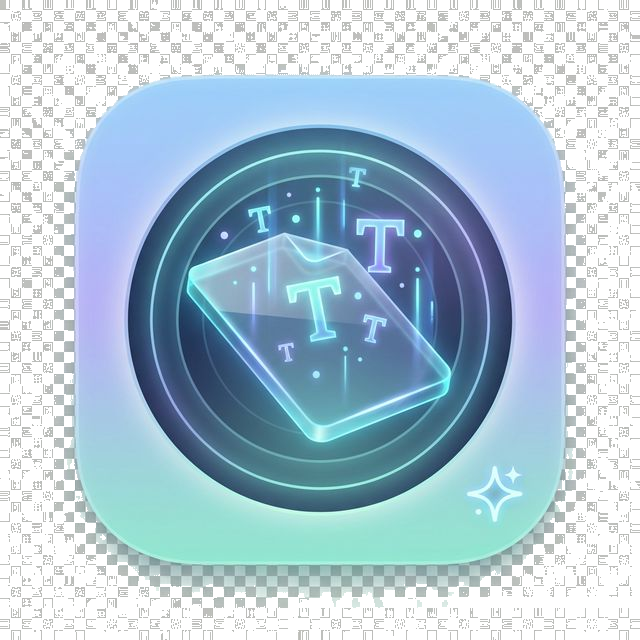
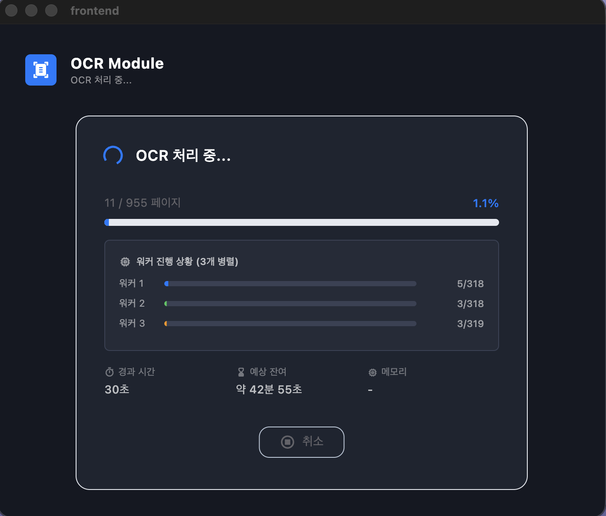

<p align="center">
  
</p>

<h1 align="center">Mac Local AI-OCR</h1>
<p align="center">
  <b>DeepSeek-OCR-2 for Apple Silicon</b><br/>
  100% 로컬 오프라인 AI 기반 PDF OCR 변환기
</p>

<p align="center">
  
  
  
  
</p>

---

이 프로젝트는 Apple Silicon Mac 환경에서 **100% 로컬 오프라인**으로 동작하는 AI 기반 PDF OCR(광학 문자 인식) 변환기입니다.
복잡한 전공 서적, 수식, 다이어그램, 코드가 포함된 문서를 DeepSeek-OCR-2 모델을 이용해 맥락을 파악하여 **'완벽하게 검색 및 복사가 가능한 PDF'**로 변환합니다.

## 3워커 병렬 OCR 처리

<p align="center">
  
</p>

> 3개의 독립 AI 모델이 PDF를 동시에 나누어 처리합니다. 각 워커의 실시간 진행률을 개별 프로그레스 바로 확인할 수 있습니다.

## 주요 기능

* **100% 로컬 구동:** 서버 전송 없이 Mac 내부 자원만 사용하여 개인정보 및 보안 문서 유출 위험 제로.
* **Apple Silicon 최적화:** `mlx-vlm` 프레임워크를 사용하여 GPU(Metal) 및 통합 메모리를 100% 활용.
* **압도적인 인식률:** 단순 글자 추출을 넘어, 다단 편집, 코드 블록, 표(Table) 구조를 이해하는 DeepSeek-OCR-2 비전 모델 적용.
* **3배속 병렬 처리:** 3개의 독립 모델 인스턴스가 PDF를 3등분하여 동시에 OCR 처리, 속도를 대폭 향상.
* **청크 기반 메모리 관리:** 10페이지 단위 청크 PDF로 저장하여 1,000페이지 이상의 대용량 문서도 안정 처리.
* **직관적인 macOS 데스크탑 UI:** Flutter로 제작된 깔끔한 네이티브 앱 환경 제공.
* **PDF 분할:** OCR 변환된 PDF를 원하는 N권으로 10페이지 단위 정렬 분할 저장.

## 기술 스택

| 레이어 | 기술 | 버전 |
| :--- | :--- | :--- |
| **Frontend** | Flutter (macOS Desktop) | 3.38.2 (stable) |
| **Backend** | Python (Virtual Env) | 3.14 |
| **OCR 모델** | DeepSeek-OCR-2-8bit (mlx-community) | 8-bit 양자화 |
| **PDF 처리** | PyMuPDF (fitz) | 최신 |
| **PDF 생성** | reportlab | 최신 |
| **ML 프레임워크** | mlx-vlm (Apple MLX) | 최신 |
| **병렬 처리** | multiprocessing (spawn) | 표준 라이브러리 |
| **통신 방식** | Subprocess (NDJSON stdout / JSON stderr) | - |

## 시스템 요구 사항

> **3개의 워커가 각각 독립 모델(~5GB)을 로드하므로, 최소 15GB 이상의 여유 메모리가 필요합니다.**

| 항목 | 최소 사양 | 권장 사양 |
| :--- | :--- | :--- |
| **OS** | macOS 14.0 (Sonoma) | macOS 15.0+ |
| **Chip** | Apple Silicon (M1) | M3/M4 Pro 이상 |
| **RAM (통합 메모리)** | **24GB** | **36GB 이상** |
| **여유 메모리** | **15GB 이상** (워커 3개 기본) | 20GB+ |
| **디스크** | 10GB 여유 | 15GB+ (모델 ~4GB + 앱 + 임시 파일) |
| **Python** | 3.10 | 3.12+ |
| **Flutter** | 3.x | 3.38+ |

### RAM 사용량 상세

| 구성 요소 | 메모리 |
| :--- | :--- |
| DeepSeek-OCR-2-8bit 모델 (워커당) | ~5GB |
| **워커 3개 동시 실행** | **~15GB** |
| 청크 처리 오버헤드 (워커당) | ~200MB |
| 메인 프로세스 + Flutter | ~500MB |
| **합계** | **~16.1GB** |

### Mac 모델별 권장 구성

| Mac RAM | 워커 수 | 실행 방법 |
| :--- | :--- | :--- |
| **16GB** | 1개 | `--workers 1` (약 6GB 사용) |
| **24GB** | 2개 | `--workers 2` (약 11GB 사용) |
| **36GB** | 3개 (기본값) | 기본 실행 (약 16GB 사용) |
| **48GB+** | 3개 (기본값) | 여유롭게 병렬 처리 + 일상 작업 동시 수행 |

> **16GB Mac에서는 반드시 `--workers 1` 옵션을 사용하세요.**
> 24GB Mac에서는 `--workers 2`를 권장합니다. 기본값(3워커)을 사용할 경우 시스템이 불안정해질 수 있습니다.

## 설치 및 실행 방법

터미널을 열고 아래 과정을 순서대로 진행해 주세요.

**1. 시스템 의존성 설치**

```bash
brew install flutter python@3.12
```

**2. 프로젝트 클론 및 설치**

```bash
git clone https://github.com/algocean1204/Mac_OCR_APP.git
cd Mac_OCR_APP
./install.sh
```

**3. 앱 실행**

```bash
cd frontend
flutter run -d macos
```

> 최초 실행 시 HuggingFace에서 DeepSeek-OCR-2-8bit 모델(~4GB)을 자동 다운로드합니다.
> 모델은 `backend/AImodels/` 폴더에 캐시되며, 이후 재다운로드 없이 즉시 로드됩니다.

## CLI 직접 실행 (선택)

Flutter UI 없이 백엔드를 직접 실행할 수도 있습니다.

```bash
cd Mac_OCR_APP
source backend/.venv/bin/activate

# 기본 실행 (워커 3개, 청크 10페이지)
python -m backend.main --input /path/to/document.pdf

# 워커 2개로 실행 (24GB Mac)
python -m backend.main --input /path/to/document.pdf --workers 2

# 워커 1개로 실행 (16GB Mac)
python -m backend.main --input /path/to/document.pdf --workers 1

# 4권 분할 + 출력 폴더 지정
python -m backend.main --input /path/to/document.pdf --split 4 --output-dir ~/Desktop

# 전체 옵션
python -m backend.main --help
```

| 옵션 | 기본값 | 설명 |
| :--- | :--- | :--- |
| `--input` | (필수) | 변환할 PDF 파일 경로 |
| `--output-dir` | `~/Downloads` | 출력 PDF 저장 디렉토리 |
| `--workers` | `3` | 병렬 OCR 워커 수 |
| `--chunk-size` | `10` | 청크당 페이지 수 |
| `--split` | `1` | 출력 PDF 분할 권 수 (1 = 분할 없음) |
| `--dpi` | `200` | PDF 이미지 변환 해상도 |
| `--model-id` | `mlx-community/DeepSeek-OCR-2-8bit` | HuggingFace 모델 ID |

## 사용 방법

1. 앱이 열리면 **PDF 파일을 드래그 앤 드롭**하거나 "파일 선택" 버튼을 클릭합니다.
2. 분할이 필요하면 **"몇 권으로 나눌까요?"** 필드에 원하는 숫자를 입력합니다.
3. **"변환 시작"** 버튼을 클릭합니다.
4. 변환이 완료되면 `~/Downloads/` 폴더에 결과 PDF가 자동 저장됩니다.
5. **"폴더 열기"** 버튼으로 바로 확인할 수 있습니다.

## 프로젝트 구조

```
Mac_OCR_APP/
├── install.sh                  # 원클릭 설치 스크립트
├── backend/                    # Python OCR 엔진
│   ├── main.py                 # 엔트리포인트
│   ├── config/
│   │   └── settings.py         # 설정 관리 (CLI + 환경변수 + 기본값)
│   ├── pipeline/
│   │   ├── controller.py       # 병렬 파이프라인 오케스트레이터
│   │   ├── chunk_worker.py     # 독립 프로세스 OCR 워커
│   │   ├── merger.py           # 청크 PDF 병합
│   │   └── page_processor.py   # 단일 페이지 처리 (레거시)
│   ├── pdf/
│   │   ├── extractor.py        # PyMuPDF PDF → 이미지 추출
│   │   ├── generator.py        # reportlab + PyMuPDF 검색 가능 PDF 생성
│   │   └── splitter.py         # PDF N권 분할 (10페이지 단위 정렬)
│   ├── ocr/
│   │   ├── engine.py           # mlx-vlm 모델 추론
│   │   └── prompt.py           # OCR 프롬프트 관리
│   ├── memory/
│   │   └── manager.py          # 메모리 모니터링 + GC + MLX 캐시
│   ├── model/
│   │   ├── downloader.py       # HuggingFace 모델 다운로드
│   │   └── validator.py        # 모델 무결성 검증
│   ├── errors/
│   │   ├── codes.py            # 에러 코드 체계 (E001~E061)
│   │   ├── exceptions.py       # 커스텀 예외 계층
│   │   └── handler.py          # stderr JSON 에러 출력
│   ├── progress/
│   │   └── reporter.py         # NDJSON stdout 진행률 보고
│   ├── utils/
│   │   └── file_utils.py       # 파일 검증 + 출력 경로 생성
│   └── AImodels/               # 모델 캐시 (gitignore, 최초 실행 시 다운로드)
├── frontend/                   # Flutter macOS 앱
│   └── lib/
│       ├── screens/            # 메인 화면
│       ├── widgets/            # UI 컴포넌트
│       ├── services/           # Python subprocess 통신
│       └── models/             # 상태 모델
├── shared/types/               # 통신 프로토콜 스키마
├── docs/                       # 설계 문서
└── AppICON/                    # 앱 아이콘
```

## 동작 방식

```
Flutter UI ──> Python Subprocess 호출
                    │
            [메인 프로세스]
                    ├── PDF 검증 + 페이지 수 확인
                    ├── 모델 다운로드 확인 (최초 1회)
                    ├── 페이지를 3등분하여 워커에 할당
                    │
              ┌─────┼─────┐
          [워커 0] [워커 1] [워커 2]       ← multiprocessing.Process (spawn)
              │       │       │
              ├─ 모델  ├─ 모델  ├─ 모델     ← 각 ~5GB, 독립 인스턴스
              ├─ PDF   ├─ PDF   ├─ PDF
              │       │       │
              │ 10p   │ 10p   │ 10p
              ├─ 추출  ├─ 추출  ├─ 추출
              ├─ OCR   ├─ OCR   ├─ OCR      ← DeepSeek-OCR-2-8bit (Metal GPU)
              ├─ 저장  ├─ 저장  ├─ 저장      ← 청크별 임시 PDF
              │ 반복   │ 반복   │ 반복
              └─────┼─────┘
                    │
            [메인 프로세스]
                    ├── 청크 PDF 병합 → 최종 PDF
                    ├── (선택) N권 분할 (10페이지 단위 정렬)
                    └── 임시 파일 정리
                    │
Flutter UI <── NDJSON stdout으로 진행률 실시간 전달
               (워커별 개별 진행률 포함)
```

## 핵심 기술 특징

* **3워커 병렬 청크 아키텍처:** 3개의 독립 워커 프로세스가 각각 모델을 로드하고, 할당된 페이지를 10페이지 청크 단위로 처리하여 처리 속도 대폭 향상.
* **워커별 실시간 진행률:** 각 워커의 진행 상황을 개별 프로그레스 바(파랑/초록/오렌지)로 실시간 확인 가능.
* **메모리 안전:** 각 청크는 최대 10페이지만 메모리에 보유 → 저장 → 해제. 1,000페이지 이상도 안정적으로 처리.
* **3단계 메모리 경고:** 4GB 경고 → 5GB 위험(추가 GC) → 8GB 강제 중단 + 부분 저장.
* **10페이지 단위 분할:** PDF 분할 시 30/30/20/20 같은 청크 단위 정렬로 깔끔한 분배.
* **무손실 PDF 병합/분할:** PyMuPDF `insert_pdf`로 메타데이터, 투명 텍스트 레이어, 북마크 완전 보존.
* **실패 복구:** 개별 페이지 OCR 실패 시 이미지만 추가하고 나머지 계속 처리.
* **CJK 폰트 지원:** 한국어/중국어/일본어 텍스트를 투명 레이어에 정확하게 매핑.
* **macOS spawn 호환:** Apple Silicon Metal/MLX와 호환되는 `multiprocessing.spawn` 컨텍스트 사용.
* **Graceful Degradation:** 페이지 수가 적으면 자동으로 워커 수를 줄여 효율적으로 처리.

## 라이선스 (License & Copyright)

### GNU AGPL-3.0 License

이 프로젝트는 **누구나 평생 무료로 사용할 수 있는 오픈소스 생태계**를 지향하며, 상업적 기업의 무단 소스코드 도용 및 클로즈드 소스화를 막기 위해 **AGPL-3.0** 라이선스를 채택했습니다. (내부적으로 사용하는 PyMuPDF의 라이선스 정책을 준수합니다.)

* **개인 사용자:** 자유롭게 다운로드하고 변형하여 무료로 사용할 수 있습니다.
* **개발자 및 기업:** 이 프로젝트의 코드를 사용하여 만든 파생 프로그램이나, 이를 백엔드로 활용한 웹/클라우드 서비스(SaaS)를 대중에게 제공할 경우, 반드시 그 서비스의 **전체 소스코드도 대중에게 동일한 AGPL-3.0 라이선스로 공개**해야 합니다. 코드를 닫아둔 채로 이익만 취하는 행위는 엄격히 금지됩니다.
